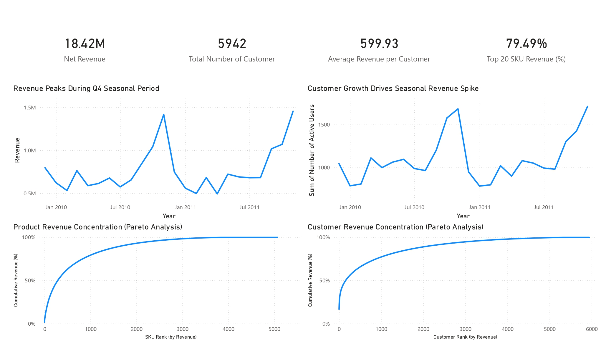
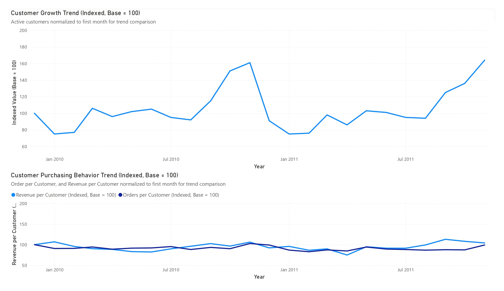
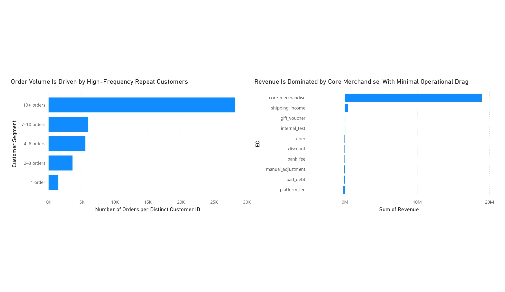

# Retail Revenue Analysis
## Executive Summary

This analysis examines a retail transaction dataset to understand revenue structure, product performance, and customer behavior over a 25-month period. Results show that nearly all net revenue is generated through core merchandise sales, while non-merchandise transactions such as platform fees, bad debt, and manual adjustments primarily function as financial offsets rather than independent revenue sources.

Revenue demonstrates strong seasonal concentration, with seasonal peak window (September–November) generating approximately **73% higher revenue** than other seasonal quarters, while off-season period maintain relatively stable performance. Further customer activity analysis indicates that this seasonal surge is primarily driven by **an increase in the number of active customers rather than higher purchasing intensity**, suggesting that peak demand periods expand the customer base rather than changing individual purchasing behavior.

Product performance follows a **Pareto-like distribution**, where roughly **20% of the 5,070 SKUs generate approximately 79.5% of total revenue**, indicating meaningful reliance on a subset of high-performing products. In contrast, customer revenue concentration remains more moderate: among identifiable buyers, the **top 20% customers contribute approximately 66.84% of total revenue**, shows  that revenue distribution is more diverse.

Overall, the analysis shows a retail business characterized by **stable baseline demand, strong seasonal expansion of customer participation, and revenue concentration within a subset of high-performing products**, while purchasing activity remains broadly distributed across a diverse customer base.

## Methodology
### Dataset
The analysis uses the **Online Retail Transaction Dataset**, which contains
historical transaction records from a UK-based retail company.
**Key attributes include:**
- Invoice ID
- StockCode (product identifier)
- Description
- Quantity
- InvoiceDate
- UnitPrice
- CustomerID
- Country

The dataset contains approximately **1067371 transaction rows**
representing retail purchases between **2009–2011.**

**SOURCE: https://www.kaggle.com/datasets/mashlyn/online-retail-ii-uci**

---
### Data Cleaning & Preparation

Initial preprocessing focused on ensuring transaction consistency and removing potential duplication.
**Key steps included:**
- Deduplicating transactional records to construct a **clean canonical event table**
- Standardizing product identifiers using **UPPER(TRIM(stockcode))**
- Filtering invalid or missing values in key transactional fields
- Separating identifiable customers from transactions without customer IDs for behavioral analysis

These steps produced a cleaned transaction table **fact\_event\_line\_clean** used for all subsequent analysis.

---
### Data Modeling

A simple analytical data model was constructed to support revenue decomposition.
**The primary tables include:**

- **fact\_event\_line\_clean\_mat**
  - Canonical event table containing invoice-level transactions, quantities, prices, timestamps, customer identification, and normalized product codes.
 
- **dim\_product\_mat**
  - Product dimension used to classify stock codes into:
  - structural categories (merchandise vs operational codes)
  - economic categories (core merchandise, platform fees, bad debt, shipping income, etc.)

This structure allowed transaction-level revenue to be aggregated across different analytical dimensions.

---
### Analytical Framework
The analysis was conducted across three primary analytical perspectives:

#### Seasonality
Seasonality was analyzed using monthly trends rather than fiscal quarters, as the dataset revealed a peak demand window between September and November that does not align perfectly with standard calendar quarter definitions.

#### Revenue Structure
Revenue was decomposed by **economic category** to understand the contribution of merchandise sales versus operational adjustments such as platform fees, bad debt, and manual corrections.

#### Product Performance
Product-level revenue distribution was evaluated using **Pareto analysis** to measure concentration across the merchandise catalog.

#### Customer Behavior
Customer activity was examined through three complementary metrics:
- **Customer concentration** – revenue distribution across identifiable customers
- **Repeat purchase behavior** – order frequency per customer
- **Monthly active customers (MAC)** – changes in active customer participation over time

Transactions without customer identifiers were excluded from customer-level behavioral metrics to prevent distortion of concentration measurements.

#### Key Metrics
- **Revenue**
  - SUM(quantity × price)
- **Monthly Active Customers (MAC)**
  - COUNT(DISTINCT customerid) per month
- **Orders per Customer**
  - COUNT(DISTINCT invoiceid) / COUNT(DISTINCT customerid)
- **Revenue per Customer**
  - SUM(quantity × price) / COUNT(DISTINCT customerid)
- **Product Pareto Contribution**
  - Cumulative share of total merchandise revenue ordered by SKU revenue.

These metrics were used to evaluate seasonality, purchasing intensity, and revenue concentration across the product catalog and customer base.

## Key Findings
### Revenue Structure
- Core merchandise generates nearly all net revenue, while non-merchandise categories primarily represent operational adjustments.
- Platform fees, bad debt, and manual corrections collectively reduce net revenue but remain proportionally small relative to merchandise sales.

### Seasonality
- Revenue exhibits strong **seasonal concentration**, with the **September–November peak retail period** generating approximately **73% higher revenue** than other months.
- Revenue across the rest of the year remains relatively stable, fluctuating within a narrow **−3% to +8% quarterly range**.

### Product Concentration
- Revenue distribution across products follows a **Pareto-like pattern**, where **20% of the 5,070 SKUs generate approximately 79.5% of total revenue**.
- The top 10 products contribute **7.6% of revenue**, indicating moderate product concentration within a broad merchandise catalog.

### Customer Behavior
- Customer behavior was examined through three complementary dimensions: revenue concentration, repeat purchase frequency, and monthly customer activity.

#### Customer Concentration
- Customer concentration analysis focuses on **identifiable buyers**, excluding transactions without customer IDs to avoid distorting customer-level metrics.
- Anonymous transactions account for **13.6% of total revenue**, indicating a meaningful portion of demand occurs without recorded customer identity.
- Among identifiable customers, the **top 10 buyers generate approximately 13.42% of revenue**, while the top **20% of customers account for roughly 66.9% of revenue**, indicating **moderate customer concentration rather than strict Pareto behavior**.

#### Repeat Purchase Behavior
- Repeat purchasing is a major driver of transaction activity. Customers with **10 or more purchases generate approximately 63% of total orders**, indicating strong reliance on returning buyers.
- One-time buyers represent a noticeable portion of customers but contribute only **3.26% of total order volume**, suggesting that most transactions come from repeat customers rather than occasional buyers.
#### Customer Activity
- Over the 25-month dataset, the business maintains an average of **\~1,080 monthly active customers (MAC)**, or **\~1,096 when excluding the partial final month,** indicating a stable baseline level of recurring demand.
- Monthly active customers fluctuate within a range of approximately **+631 / –393 customers from the average** across the observation period, reflecting seasonal expansion and contraction of the customer base while maintaining a consistent underlying demand level.
- Customers place an average of **1.65 orders per month**, with relatively small fluctuations (+0.22 / –0.31), suggesting that purchasing intensity remains consistent throughout most of the year.
- Average **revenue per customer is approximately 595.85 per month**, with moderate variation (+117.94 / –122.86).
- The seasonal revenue surge is primarily driven by **an increase in the number of active customers rather than increased purchasing frequency**, indicating seasonal expansion of the customer base during the **September–November peak retail period**.

## Business Implications
- Merchandise sales constitute the core revenue engine of the business, with operational categories primarily reflecting financial adjustments rather than independent revenue streams. This indicates that overall performance is largely determined by product sales rather than operational services.
- The strong **seasonal revenue concentration during the September–November period** suggests that the business operates within a demand cycle typical of retail or gift-oriented markets, where peak demand periods expand the active customer base rather than increasing purchasing intensity among existing customers.
- Revenue distribution across products shows meaningful concentration, with a relatively small subset of SKUs accounting for a large share of total revenue. This highlights the structural importance of maintaining availability and performance of high-impact products within the catalog.
- Customer revenue distribution shows moderate concentration among identifiable buyers. While higher-value customers contribute a significant share of revenue, overall purchasing activity remains distributed across a broad customer base.
- Repeat purchasing plays a substantial role in sustaining transaction volume, as customers with frequent purchase histories generate the majority of order activity. This indicates that returning customers are an important component of the business’s ongoing demand.
- Customer activity levels remain relatively stable outside seasonal peaks, with consistent order frequency and revenue per customer throughout the year. The Q4 revenue surge is therefore primarily explained by increased participation from additional customers rather than changes in purchasing behavior.
- A meaningful portion of transactions lacks identifiable customer IDs, representing a limitation for customer-level behavioral analysis and suggesting that part of the customer base cannot be directly tracked over time.

## Visual Analysis
The following visualizations support and validate the key findings outlined above, illustrating how revenue, customer activity, and product performance interact across time.
### **Revenue Performance Overview**
This dashboard summarizes overall revenue trends, customer activity, and revenue concentration.
Revenue exhibits a clear seasonal pattern, with pronounced peaks during the **September–November period**, while maintaining relatively stable performance during off-peak months.
At the same time, Pareto analysis shows that:
- A small proportion of products contributes the majority of revenue
- Customer revenue is more broadly distributed compared to product concentration

Together, these patterns indicate a business with predictable seasonal demand and structural dependence on high-performing products, supported by a relatively diverse customer base.

### **Drivers of Seasonal Revenue Growth (Indexed Analysis)**
To enable direct comparison across metrics with different scales, customer count, orders per customer, and revenue per customer were normalized using an index **(base = 100)**.

The visualization shows a clear divergence between customer growth and purchasing behavior:
- Active customers increase significantly during peak periods
- Orders per customer and revenue per customer remain relatively stable

This confirms that revenue growth is primarily driven by **customer expansion rather than increased purchasing intensity**, indicating that seasonal demand is fueled by higher participation rather than changes in individual behavior.

### **Customer Segmentation and Revenue Stucture**
Customer activity and revenue composition reveal two key structural characteristics:
- **Order volume is heavily driven by high-frequency repeat customers**, with customers making 10+ purchases contributing the majority of transactions
- **Revenue is overwhelmingly generated by core merchandise**, while other categories contribute minimally

These findings indicate that the business relies on a combination of:
- Strong **customer retention and repeat purchasing behavior**
- A **product-centric revenue model**, where merchandise sales dominate overall performance

## Technical Notes
### Stock Code Normalization
Product stock codes were normalized using: *UPPER(TRIM(stockcode))*
This step ensured consistent product identification by removing trailing spaces and standardizing letter casing. Without normalization, identical product codes with inconsistent formatting could appear as separate SKUs and distort aggregation results.
### Structural vs Economic Classification
Product codes were first categorized using **structural classification** based on their format (numeric-first merchandise codes vs alphabetic operational codes).
This step allowed the analysis to isolate operational transaction codes before defining **economic categories** such as:
- core merchandise
- platform fees
- bad debt
- manual adjustments
- shipping income

Separating structural and economic classification ensured that operational codes were correctly identified before revenue interpretation.

### Deduplicated Event Table
The analysis was performed using a cleaned canonical event table *fact\_event\_line\_clean\_mat* derived from the original dataset.
This table represents deduplicated transactional records and was used as the primary fact table for all revenue calculations.

### Anonymous Customer Handling
Transactions without identifiable *customerid* values account for approximately **13.6% of total revenue**.
These transactions were included in revenue analysis but **excluded from customer-level behavioral metrics** (such as customer concentration and repeat purchase analysis) to prevent distortion of customer-level results.

### Operational Categories in Product Analysis
Operational transaction categories (platform fees, bad debt, adjustments, etc.) were excluded from product-level Pareto analysis because they do not represent merchandise sales.
Pareto analysis therefore focuses only on **core merchandise revenue**, allowing product concentration to be evaluated independently from operational financial adjustments.

